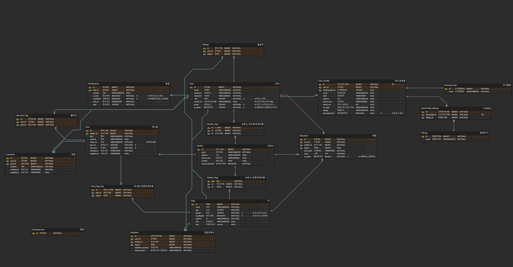
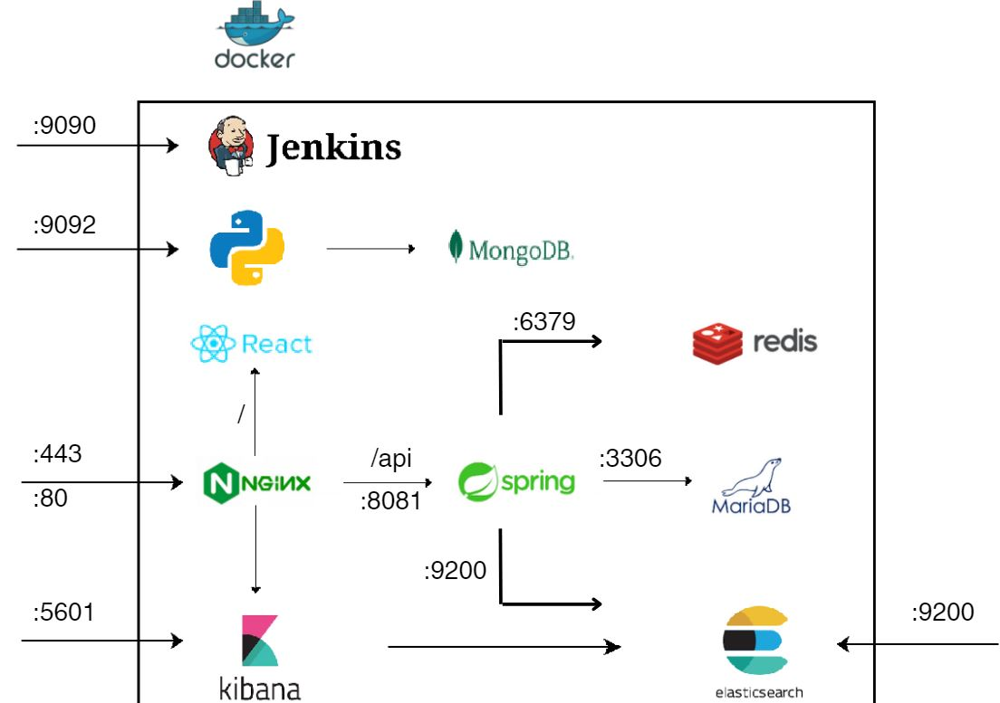

#  IfSae (잎새) - 빅데이터 추천을 기반으로 한 유기견 입양 및 후원 플랫폼

> **빅데이터와 영상 콘텐츠 기반의 유기견 입양 및 후원 플랫폼, 잎새 - 더 나은 미래를 위한 따뜻한 연결**  
> **개발기간 : 2024.08.13 ~ 2024.10.10**

## 프로젝트 소개

### 1. 기획 및 배경

현재 1인 가구의 증가와 함께 반려동물 양육 가구가 급격히 늘어나면서, 책임을 다하지 못한 채 반려동물을 유기하는 사례가 증가하고 있습니다. 이사, 경제적 어려움, 부재 시 동물을 돌볼 방법의 부재와 같은 현실적인 문제로 인해 반려동물을 포기하는 경우가 많아지고 있는 것입니다. 또한, 과거부터 이어져온 비윤리적인 번식업자들에 의해 운영된 개농장에서 구조되는 유기견들이 늘어나면서, 유기동물의 수 역시 지속적으로 증가하고 있습니다.

이로 인해 많은 동물들이 보호소에서 입양을 기다리고 있지만 보호소의 수용 및 경제적인 측면에서 더 이상 수용할 수 없다고 판단된 동물들은 안락사를 피할 수 없는 상황에 처해있습니다.

이전의 보호소 입양 및 후원 플랫폼은 대부분 금전적 거래나 단순 정보에 그쳐 사용자가 후원이나 입양에 대해 흥미를 가지지 못하는 경우가 많습니다.

잎새는 이러한 문제를 해결하기 위해 사용자 맞춤형 추천 알고리즘과 감성적 영상 콘텐츠를 통해 유기동물에 대한 관심도를 올려 후원 및 입양 유도를 새로운 방식으로 접근하였습니다. 사용자 취향에 맞는 강아지를 추천하고, 짧고 감동적인 숏츠 영상을 통해 유기동물에 대한 긍정적인 관심을 유도하여, 입양을 고민하는 사용자들이 입양을 결심할 수 있도록 돕습니다.

또한 입양이 어려운 사용자들도 후원 기능을 통해 유기견의 안락사 기간 연장에 기역할 수 있도록 하여, 더 많은 유기 동물들이 입양될 수 있는 가능성을 높이고자 하였습니다.

### 2. 주요 기능

- 영상 추천 알고리즘을 기반으로 한 숏츠 및 영상 페이지
- 강아지 추천 알고리즘을 기반으로 한 입양 페이지
- ElasticSearch 및 Spring ElasticSearch를 이용하여 구현한 영상 통합 연관 검색 기능
- Spring Security 및 JWT를 이용한 유저 관리 기능

### 3. 기술 스택

**1. Language**

**2. BackEnd**

**3. Frontend**

**4. Communication**

**5. Database**

## 데이터 분석

### 1. 기초 데이터 수집

- 국가동물보호정보시스템의 유기동물 보호 api를 활용하여 1만여 마리의 기초 데이터를 수집하였습니다. 해당 데이터에는 고유번호를 포함하여 나이, 몸무게, 성별, 이름, 보호소, 위치 등 다양한 정보가 포함되어 있습니다.

### 2. 데이터 전처리

- 결측치 처리 : 데이터에는 나이가 없거나, 이미지가 없거나 하는 등의 결측치가 있습니다. 데이터를 수집하는 과정중에 결측치를 미리 파악하여 해당 column을 제외하거나 더미데이터를 넣는 등으로 처리하였습니다.
- data type에 맞춰 parsing : api에서 넘어오는 데이터는 모두 String형태입니다. 또한 종분류와 세부 품종이 하나로 묶여 있는 등 사용하기 어려운 형태로 있는 데이터들을 parsing하여 처리 해주었습니다.
- Image Vector 저장 : 추천 시스템에 활용하기 위해 각 보호동물이 가지고 있는 image를 모델<wesleyacheng/dog-breeds-multiclass-image-classification-with-vit>에 넣어 120개의 견종으로 분류하여 견종별 vector점수를 기입하였습니다.

### 3. 추천시스템

- 개인화 추천
  -- Survey 기반 점수 : 앞서 저장해둔 'image Vector Table'과 각 견종별로 특성 값을 저장한 'Character Table' 2가지를 가지고서 **각 보호동물 별 특성 점수 테이블**을 미리 제작합니다. User는 회원가입을 할 때 survey를 제출하며 제출한 survey 를 기반으로 기존의 보호동물 별 특성 테이블의 점수와 비교하여 유클리드 거리순으로 보호동물 순위를 매김.
  -- Content Based : User가 좋아요 한 정보의 이미지 벡터의 합으로 해당 유저가 선호하는 이미지 벡터를 얻습니다. 이 데이터와 보호동물 별 Image Vector Table를 코사인 유사도로 비교하여 방향성이 가장 가까운 순으로 보호동물의 순위를 매김.
- 비개인화 추천
  -- 추천순 : 추천의 점수를 기준으로 보호동물의 순위를 매김.
  -- 최신순 : 보호동물의 유기보호소에 등록된 날짜를 기준으로 순위를 매김.

- 종합과정
  위의 4개의 순위 데이터를 가지고서 각 랭크별로 가중치를 다르게 두어서 최종합 순위를 뽑아냅니다.
  뽑아낸 보호동물의 순위를 바탕으로 해당 동물이 가지고 있는 가장 최신 영상을 추천해줍니다.

## 페이지 소개

**1. 로그인 회원가입 페이지**

- 회원 가입 선택 시 일반회원 가입과 센터 회원 가입으로 나누어집니다.
- 일반 회원 가입을 선택할 경우 첫 로그인 시 간단한 설문조사를 통해 강아지에 대한 선호도를 조사하여 해당 데이터를 기반으로 메인페이지에 노출할 영상 순서를 구성합니다.
- 센터 회원 가입을 선택할 경우 플랫폼 관리자가 확인 후 수락을 눌러야 그 이후 부터 센터로서의 활동이 가능하도록 설계하였습니다.

**2. 영상 페이지**

- 각 유저의 선호도 설문, 좋아요한 영상, 팔로우한 강아지 기반으로 구축한 추천 알고리즘과 최신순, 인기순 영상을 섞어 100개의 영상 데이터 순서를 구성하고 이를 노출합니다.
- 영상을 누르면 영상의 상세페이지로 이동하여 영상을 재생할 수 있습니다.
- 영상의 상세 페이지에서는 영상과 관련되 강아지 프로필, 센터 프로필, 영상 설명, 영상의 댓글을 조회할 수 있으며 좋아요를 눌러 영상 및 입양 추천에 반영할 수 있습니다.
- 연관된 강아지 페이지를 누르면 강아지프로필 페이지로 이동하여 강아지를 팔로우하거나 입양 및 후원을 신청할 수 있습니다.

**3. 숏츠 페이지**

- 각 유저의 선호도를 기반으로 추천된 강아지의 영상 중 최신순 영상을 보여줍니다.
- Intersection Observer API를 사용하여 무한스크롤로 구성하였습니다. 사용자에게 끊김없는 영상을 제공할 수 있도록 영상 10개의 데이터를 불러온 후 스크롤을 감지하여 5번째 영상이상 스크롤을 내렸을 경우 추가 데이터를 로드하는 식으로 구현하였습니다.

**4. 입양 페이지**

- 추천 알고리즘을 기반으로 추천된 강아지의 추천 리스트를 노출 합니다.
- 팔로우한 강아지의 섹션을 따로 두어 내가 팔로우 한 강아지를 더 자세하게 볼 수 있도록 하였습니다.

## **5. 마이페이지**

- 일반회원의 경우 일반, 센터 선택 탭이 노출되지 않습니다.
- 일반 페이지에서는 유저의 좋아요한 영상, 팔로우한 강아지, 후원 신청 현황, 입양 신청 현황등을 조회하고 관리할 수 있습니다.
- 센터페이지에서는 센터 관리에 필요한 영상 목록 관리, 등록된 강아지 관리 및 추가, 후원 입양 신청 조회 및 관리 기능이 제공됩니다.

## ERD 및 아키텍처

### ERD

- 유저를 크게 일반사용자, 보호소 관리자로 구분하기 위해 유저타입에 해당하는 컬럼을 추가하였습니다.
  이를 바탕으로 보호소 관리자의 경우 보호소와 연결할 수 있도록 중계 테이블을 설정하여 다대다 관계를 표현하였습니다.

- 신청자 정보, 강아지 정보를 포함하여 입양 신청, 후원 신청 내역을 가지고 있고 특히 입양 신청이 수락된 경우 입양 신청 내역의 상태를 변경하도록 하였습니다.

- 추가로 입양이 승인된 경우 해당 강아지의 소속을 변경하고 일반 사용자가 입양을 처음 하게된 경우 자신이 입양을 한 사용자임을 표시하도록 설계하였습니다.

- 게시글은 댓글과 좋아요를 가질 수 있도록 하였고 좋아요의 경우 각 사용자당 한 번만 할 수 있도록 개별 테이블에 사용자의 좋아요 기록을 저장하였습니다.

- 팔로우 테이블을 통해 각 유저별 팔로우하고있는 강아지를 조회할 수 있도록 하였습니다.

- 강아지의 상태가 변경될 가능성을 염두하여 다른 테이블과의 연관관계를 줄이고 독립적으로 관리할 수 있도록 하기위해 중계테이블을 두고 상태가 변경되면 이를 수정하는 방식으로 구현하였습니다.

### 아키텍처 설계

 
 

## 프로젝트 개선점

- 유기견 분류를 외형적 특성 뿐 아니라, 나이나 발견 당시 성향 등을 기준으로 좀 더 세분화 한다면 좋은 추천 알고리즘을 만들 수 있을 것 같다고 생각합니다.
- 데이터의 개별 백터화 대신 클러스트링을 하여서 추천 시스템을 구성하였다면 협업 필터링 방식 등 다양한 알고리즘을 사용해볼 수 있을 것이라 생각합니다.
- 또한, 선호도 데이터 또는 유저들의 행동 데이터를 먼저 확보하였으면 협업 필터링이나 뉴럴 네트워크 방식과 같은 더 다양한 방식을 구현할 수 있었을 것이라는 아쉬움이 있습니다.
  <회고>
- 데이터 : 기획 단계에서 추천 시스템 평가에 대한 기준과 계획을 세우고 평가를 진행했다면 하는 아쉬움이 있습니다.
