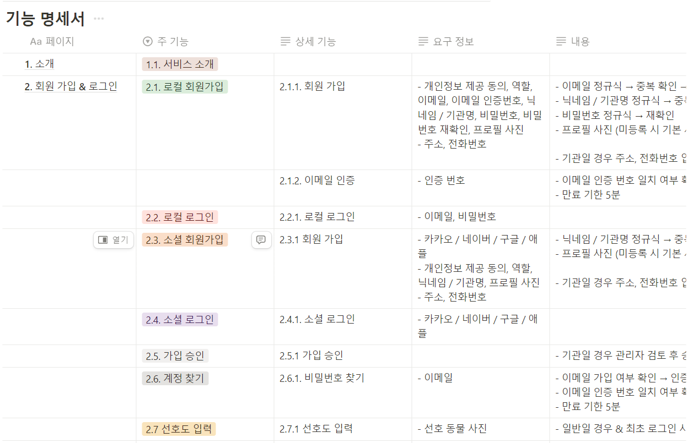
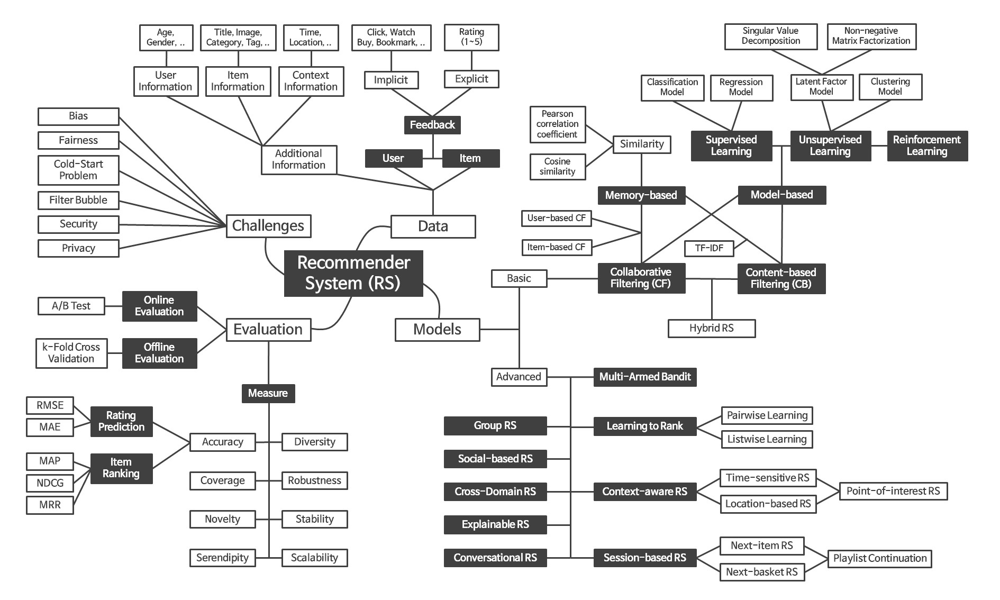

# 2024-08-26 ~ 2024-08-29

## 1. 한 일
- 서비스 기획 및 기능 명세서 작성 
> **기능 명세서**

- 빅데이터 set 파악 및 수집
  - 서울 열린데이터 광장 - 서울동물복지지원센터 입양대기동물 현황
  - 서울 열린데이터 광장 - 서울동물복지지원센터 입양대기동물 현황(사진포함)
  - 국가동물보호정보시스템

- 빅데이터 전처리 작업 진행 中  
총 3 곳에서 모은 데이터 set을 파악하여 공통 부분을 찾아서 정리

## 2. 학습한 내용
- 빅데이터를 추천하는 방식은 한 가지 방식이 아닌 여러가지 방식이 존재한다. 
다양한 방식 중, 데이터의 수, 데이터의 유형, 찾고자 하는 데이터 종류 등에 따라 다른 방식을 사용하며, 여러가지 방식을 혼합하여 사용하기도 한다.
> **빅데이터 추천 리스트**

- 추천의 정확도는 정량적으로 파악하기 어렵다. 이 추천이 실제로 잘 된 추천인지, 아닌지는 정량적으로 검증할 방법이 없다. 그래서 기업들은 클릭률이나 사이트 체류시간 등을 근거로 추천의 정확도를 산출하기도 한다.
- 빅데이터 분석을 위해서는 주로 Python이 많이 사용된다. numpy와 pandas의 학습이 필요하다.

## 3. 다음에 학습할 내용
- numpy와 pandas 학습
- 빅데이터 추천 알고리즘 학습
- 데이터 전처리 작업 완료

## 4. 느낀점
- 빅데이터의 추천은 생각보다 복잡하고 어려운 과정이다. 알고리즘의 선택은 차치하고, 어떤 데이터를 사용할 것인지, 어떤 내용을 추천할 것인지 등을 선별하는 것도 굉장히 어려운 일이다. 또한, 추천하고자 하는 내용을 정하여도 원하는 데이터set을 찾아내는 것은 또 다른 어려움이다. 
하나의 데이터set에서 원하는 자료를 뽑아내고 추천하는 것도 가능하지만, 조금 더 고차원적인 서비스를 제공하기 위해서는 다양한 파트의 데이터set을 조합하고 분석하는 것이 필요하다는 것을 느꼈다. 
