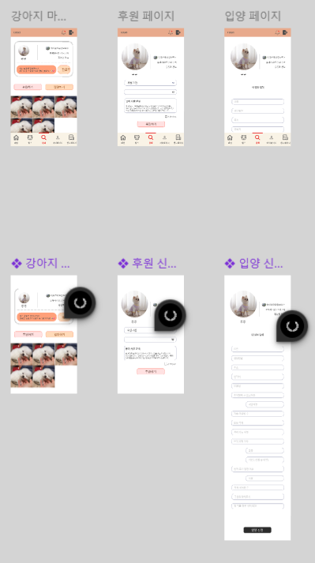
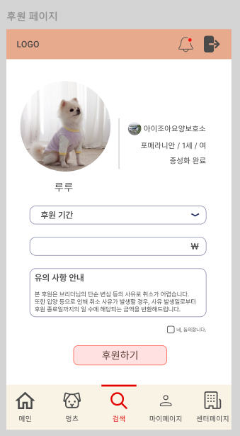
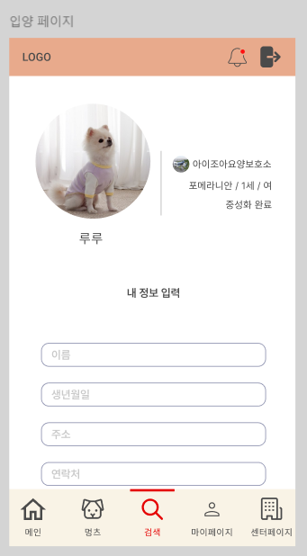

## [2024_08_26]
# 한 일
- 아이디어 회의
- Jira Convention 작성

# 학습 내용
- Jira

## 1. 구성요소

### 1.1. Epic
- 큰 단위의 업무
- 요구 사항 명세서의 대분류

### 1.2. Issue
- 프로젝트 진행 중 발생하는 모든 분류의 이야기
- Task를 포괄

### 1.3. Task
- Epic의 하위 단위 작업으로 직접적인 기능 구현
- 요구 사항 명세서의 중분류

### 1.4. SubTask
- 세분화 된 Task
- 요구 사항 명세서의 소분류

## [2024_08_27]
# 한 일
- 2차 팀미팅
- 아이디어 회의
- 빅데이터 자료 조사

# 학습 내용
- 빅데이터

## 1. 5V

### 1.1. 규모 (Volume)
- 대량의 데이터.
- 일반적으로 테라바이트(TB)에서 페타바이트(PB) 이상의 크기를 가지며, 지속적으로 증가하는 경향.

### 1.2. 다양성 (Variety)
- 다양한 유형과 형식의 데이터를 포함.
- 구조화된 데이터뿐만 아니라 비구조화된 데이터, 텍스트, 이미지, 오디오, 비디오 등 다양한 형태의 데이터를 다루며, 다양한 소스에서 수집.

### 1.3. 속도 (Velocity)
- 고속으로 생성되고 전송되는 특성.
- 실시간으로 발생하는 데이터 스트림이나 고속의 데이터 처리를 필요.

### 1.4. 가변성 (Variability)
- 다양한 형식과 소스에서 생성되며, 다양한 시기에 발생하는 특성.
- 데이터의 가용성, 변동성, 불규칙성 등 컨트롤.

### 1.5. 정확성 (Veracity)
- 데이터의 신뢰성과 정확성 확보.
- 데이터의 오류, 노이즈, 부정확성 등을 고려하여 데이터의 신뢰도 확보.

## [2024_08_28]
# 한 일
- 아이디어 기획
- Linux 학습

# 학습 내용
- Linux 기초

## 1. 구성요소

### 1.1. 셸
- 사용자의 명령어와 커널 사이에서 언어를 번역
- CLI / GUI 2가지 형태
- 운영체제 바깥 계층에 위치

### 1.2. 커널
- 리눅스 운영체제의 핵심.
- 운영 체제를 조작하여 입력된 작업을 수행

### 1.3. 사용자 프로그램
- 리눅스 환경에서 사용하는 프로그램

## 2. apt
- 패키지 관리자
- 소프트웨어 설치, 제거, 업데이트

  ### 2.1. 권한
    1. 전체 권한
        - sudo 명령어를 통해 최고 관리자 root 의 권한 획득
    2. 폴더별 권한
        - ls -al 명령어를 통해 모든 파일 속성 확인
        - chmod [파일권한][파일 위치 / 이름] 을 통해 권한 변경
            - r(읽기, 4), w(쓰기, 2), x(실행, 1)
        - chown [소유할유저]:[소유할 그룹] [파일 위치 또는 파일명] 을 통해 소유자 변경

## 3. 파일 시스템

### 3.1. 파일 시스템의 종류
1. FAT
    - 파일 할당 테이블
2. NTFS
    - Windows NT 계열의 파일 시스템
    - FAT 구조 대체 위해 제작
3. EXT
    - 확장 파일 시스템
    - 리눅스 기본 파일 시스템

### 3.2. 리눅스 디렉토리 구조
- root
    - bin
        - 기본 명령어 저장
    - boot
        - 리눅스 boot 와 관련한 명령
    - etc
        - 리눅스 설정 파일
    - home
        - 홈
    - lib
        - 리눅스 및 각종 프로그램에서 사용되는 라이브러리

## [2024_08_29]
# 한 일
- 기능 정의
- 와이어 프레임 작성
- Docker 학습

# 학습 내용
- Docker 기초

## 1. Docker 란?
- 컨테이너를 쉽게 다루게 도와주는 일종의 플랫폼입니다.
- 컨테이너는 사용자가 실행할 때 필요한 환경을 패키징 하여 설치 없이 한번에 실행하도록 환경 구축.
- Dependency 까지 한번에 포함되어있기 때문에 사용자의 환경에 관계없이 실행이 가능.

## 2. 이미지 pull & push
- 컨테이너는 이미지를 기반으로 생성.
- 실행에 필요한 요소 (환경, 코드, 실행파일 등) 를 이미지로 만들어 컨테이너를 실행.
- 이러한 이미지는 레이어 (층) 구조로 형성.
- 가장 베이스가 되는 이미지 (주로 OS 관련 이미지를 사용) 를 가장 아래에 쌓고 그 위에 필요한 패키지들을 설치 하는 등 어플리케이션에 필요한 구조를 구축.
- 도커 허브에서 이미지를 `docker pull [image name]`을 통해 다운 받아 사용.
- 컨테이너 실행 시 우선적으로 local repository에 해당 이미지가 있는지 검색하고 없으면 docker hub에서 검색.
- 로컬 리포지토리는 `docker images`로 확인.
- docker hub에서 repository를 생성하고 이미지를 repository의 주소로 tag하여 push 가능.

## 3. 컨테이너 실행
```docker run [option]```
- 컨테이너를 실행

```docker pull```
- local repository에 다운받고 컨테이너를 실행.

## 4. 자주 사용하는 옵션
### 4.1. ```port```
- 컨테이너에서 사용하는 포트와 호스트의 포트를 연결해 호스트를 통해 컨테이너에 접속.

### 4.2. ```Volume```
- volume은 컨테이너안의 파일과 컨테이너 안의 파일을 공유하는데 사용.
- 컨테이너 안에서 작업한 내용을 호스트에서 관리하거나 컨테이너가 삭제되어도 데이터를 보존하기 위해 사용.

```
-v [host_path:container_path]
```

### 4.3. ```env```
- env 옵션은 컨테이너에 환경변수를 설정.
- 보통 이미지 관리자가 컨테이너 실행에 필요한 환경변수를 전달.

### 4.4. 그 외의 옵션

```
-d
```

의 옵션은 백그라운드 실행.

```
--name
```

컨테이너 이름 지정.

```
-it
```

컨테이너 내부에서 명령어를 실행.

## [2024_08_30]
# 한 일
- 와이어 프레임 작성

# 학습 내용
- 피그마 사용법
  - 컴포넌트 작성법




